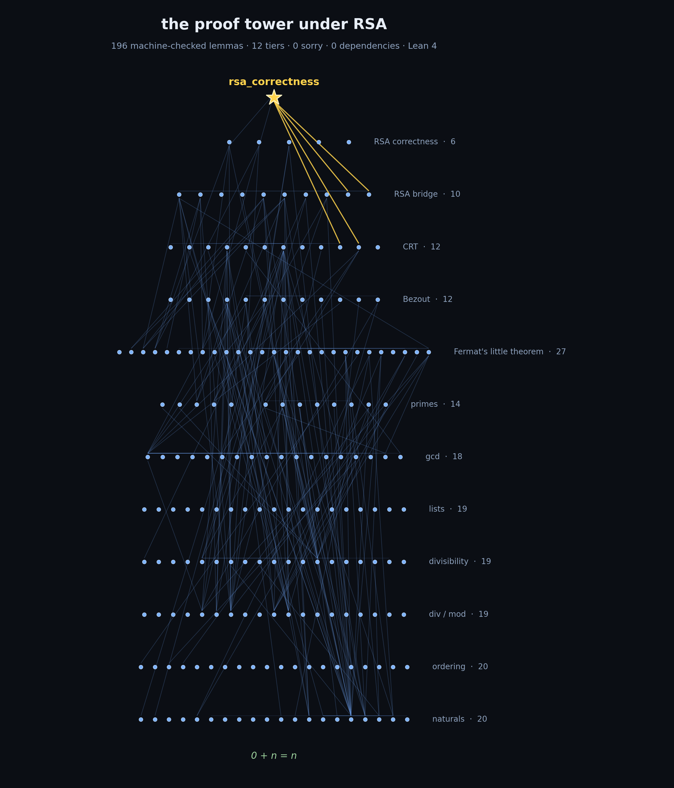

# Ground Truth

RSA correctness from first principles in pure Lean 4. No Mathlib. No sorry. No trust required.



*Every dot is a proven lemma; every line is one proof resting on another. Generated from this repo by [`scripts/proof_tower.py`](scripts/proof_tower.py).*

## What This Is

196 machine-checked lemmas across 12 tiers, starting from `0 + n = n` and ending with a proof that RSA encryption/decryption is mathematically correct.

Every step is verified by Lean's type-checker. You don't need to trust the author. Run `lake build` and the computer confirms every proof.

## The Chain

| Tier | What It Proves | Lemmas |
|------|---------------|--------|
| 1 | Natural number basics (2+2=4, commutativity, associativity) | 20 |
| 2 | Ordering (less-than, min, max) | 20 |
| 3 | Division & modular arithmetic | 19 |
| 4 | Divisibility (what divides what, even/odd) | 19 |
| 5 | Lists & structural induction | 19 |
| 6 | GCD & coprimality | 18 |
| 7 | Primes & Euclid's infinity of primes | 14 |
| 8 | **Fermat's Little Theorem** | 27 |
| 9 | Bezout's identity & modular inverse | 12 |
| 10 | **Chinese Remainder Theorem** | 12 |
| 11 | Fermat-to-RSA bridge | 10 |
| 12 | **RSA correctness** | 6 |
| | **Total** | **196** |

## The Capstone

```lean
theorem rsa_correctness (m d e p q : Nat)
    (hp : Primes.IsPrime p) (hq : Primes.IsPrime q) (hne : p ≠ q)
    (hde : ∃ k, d * e = 1 + k * ((p - 1) * (q - 1))) :
    m ^ (d * e) % (p * q) = m % (p * q)
```

In plain English: for any two distinct primes p and q, if the encryption key e and decryption key d satisfy `d * e ≡ 1 mod (p-1)(q-1)`, then encrypting and decrypting any message m gives back m. This is what every RSA implementation in the world relies on.

## Scope, Honestly

Two things this is **not**, so nobody has to point them out:

- **This proves correctness, not security.** The theorem says textbook RSA decryption recovers the message. It makes no claims about padding, key generation, randomness, or side channels, which is where real-world RSA security actually lives and dies.
- **RSA has been formalized before**, in Coq, Isabelle, and Lean with Mathlib. The point of this repo is different: zero dependencies. Every lemma used, from `0 + n = n` up to the Chinese Remainder Theorem, is in this repo and checked in one build.

## Verify It Yourself

```bash
# Install Lean 4 (if you haven't)
curl https://raw.githubusercontent.com/leanprover/elan/master/elan-init.sh -sSf | sh

# Clone and build
git clone https://github.com/adventurelands/rsa-correctness-lean4.git
cd rsa-correctness-lean4
lake build
```

If `lake build` succeeds with no errors, every statement in the repo type-checks against Lean's kernel. What the machine verifies is that each proof is valid; whether the *statements* say what I intend them to say is exactly the kind of thing human experts are better at than machines. See below.

## Author's Note

I'm not a mathematician or a cryptographer by training; I came to formal verification through self-study. If you work in formal methods, number theory, or cryptography and you spot anything here (a theorem statement that's weaker than it looks, a definition that smuggles in an assumption, or just a better way to structure the chain), I'd genuinely appreciate hearing it. Open an issue or reach out: davis@team8.co.

## Trust Base

Three axioms, all part of Lean's core (not introduced by us):
- `propext` (propositional extensionality)
- `Quot.sound` (quotient soundness)
- `Classical.choice` (axiom of choice)

Zero custom axioms. Zero sorry. Zero Mathlib dependency.

## Stats

- **196** lemmas
- **2,553** lines of Lean 4
- **12** tiers
- **0** sorry
- **0** external dependencies

## How It Was Built

Human-AI collaboration in a single session. A Python orchestrator tested automated tactics (omega, simp, induction) against each lemma. Lemmas that resisted automation were sent to DeepSeek-Prover-V2 (7B) and Gemma 4 E4B running on a local RTX 2060, with Lean's type-checker as the oracle. Hard proofs (Fermat's Little Theorem, Bezout, CRT, prime existence) were written by hand with AI tactic suggestions.

## License

MIT
